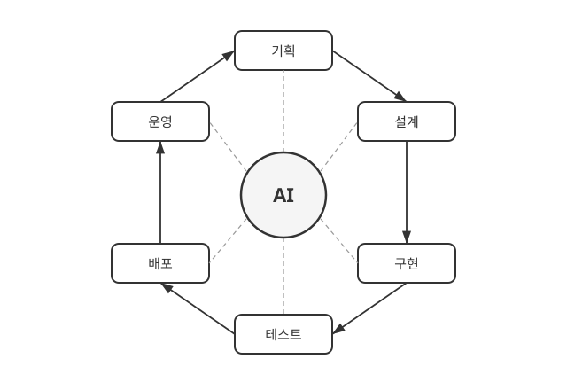
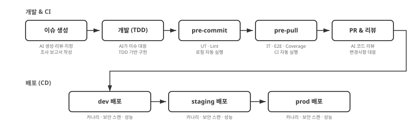
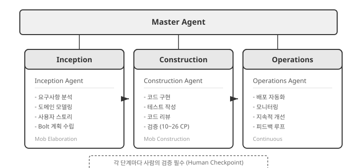
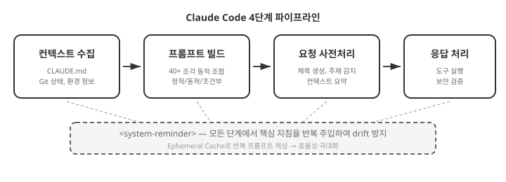

<!-- _class: lead invert -->
<!-- _paginate: false -->

# State of Vibe Coding

## 바이브 코딩의 현 주소

<br>

ROBOCO 바이브 코딩 워크숍

---

# 바이브 코딩이란?

> "fully give in to the vibes, embrace exponentials,
> and forget that the code even exists."
> — Andrej Karpathy, 2025. 2.

- OpenAI 공동창업자 Andrej Karpathy가 정의한 AI 기반 개발 방식
- 2025년 **Collins 영어사전** 올해의 단어 선정
- 자연어로 AI에게 지시하여 소프트웨어를 만드는 접근법
- 현재는 소프트웨어 라이프사이클 전반에서 AI와 협업하는 방식을 총칭함

<br>

**단순한 코드 자동완성이 아니다.**
AI를 팀원으로 두고 소프트웨어 라이프사이클 전반에서 협업하는 방식이다.

---

# 이 워크숍이 제안하는 바이브 코딩

- "코드를 보지 않는 개발자"가 되는 것이 목표
- 해결할 문제를 명확하고 구조적으로 정의
- 조사, 계획, 설계, 구현, 테스트, 배포, 운영까지 AI가 주도적으로 수행
- 개발자의 역할은 "신뢰 할 수 있는 프로세스를 설계"하는것

---

# 코드 생성을 넘어 — 전체 라이프사이클에 AI를 투입



- 기획부터 운영까지, **모든 단계** 에서 AI와 함께
- 코드 작성은 전체 라이프사이클의 일부에 불과
- 설계, 리뷰, 테스트, 문서화, 배포까지 AI가 참여

---

# SDLC 각 단계에서 AI가 하는 일

| 단계 | AI 활용 예시 |
|------|-------------|
| **요건 정의** | 시장·경쟁사 조사, 사용자 스토리 생성, 요구사항 문서화 |
| **설계·아키텍처** | DB 스키마 설계, OpenAPI 스펙 생성, 아키텍처 의사결정 기록 |
| **구현·테스트** | 코드 생성, 단위·통합 테스트 작성, AI 코드 리뷰 |
| **문서화** | API 문서, 온보딩 가이드, 변경 이력 자동 생성 |
| **보안** | 취약점 스캔, 위협 모델링, OWASP 컴플라이언스 점검 |
| **DevOps** | CI/CD 파이프라인·IaC 구축, 모니터링, 실시간 장애 대응 |
| **유지보수** | 버그 분류·수정, 리팩토링, 의존성 업데이트 |

<span class="source">출처: PwC Future of Solutions Dev (2026), Microsoft AI-led SDLC (2025)</span>

---

<!-- _class: lead invert -->

# 왜 도입해야 하는가?

---

# 경쟁자를 압도하는 생산성

## Anthropic 내부 도입 결과

| 지표 | 수치 |
|------|------|
| 자체 보고 생산성 향상 | **50%** (전년 20% → 50%) |
| 일상 업무 AI 활용률 | **59%** (전년 28% → 59%) |
| 엔지니어당 일일 PR 머지 | **67%** 증가 |

> "산출물의 볼륨 자체가 크게 증가했다." — Anthropic Engineering

<span class="source">출처: Anthropic Economic Index (2025.9)</span>

---

# Anthropic의 실제 활용 사례

### 데이터 인프라팀
Kubernetes 장애를 비전문가가 AI 도움으로 **독립 해결**
대시보드 스크린샷을 AI에 제공 → Pod IP 고갈 원인 진단 → 조치 명령어 생성

### 프로덕트 디자인팀
목업 이미지를 AI에 전달 → 기능 프로토타입 생성, **2~3배 빠른 실행**
1주일간의 코디네이션 작업 → 30분 x 2회 콜로 완료

### 보안 엔지니어링팀
낯선 코드베이스에서 독립적으로 버그 디버깅
"어떤 파일을 봐야 하는가"를 AI가 즉시 식별

<span class="source">출처: codingscape.com/blog/how-anthropic-engineering-teams-use-claude-code-every-day</span>

---

# AI 코딩 도구의 진화

| 시점 | 변화 |
|------|------|
| 2025. 9 | Claude Code 2.0 — 자동 체크포인트, hooks, 백그라운드 작업 |
| 2025. 9 | SWE-bench Verified **77.2%** (업계 최고 수준) |
| 2026. 2 | Claude Opus 4.6 — **Agent Teams** (다중 AI 에이전트 협업) |
| 2026. 2 | 100만 토큰 컨텍스트, 12.8만 토큰 출력 |

- **Hooks:** 편집 후 린터, 커밋 전 테스트 등 자동 실행
- **Agent Teams:** 여러 AI 에이전트가 독립 컨텍스트에서 병렬 협업
- **자동 체크포인트:** AI 변경 전 자동 저장, 즉시 롤백 가능

> AI의 발전 속도를 감안하면, **지금이 가장 능력이 낮은 시점** 이다.

---

# AI 능력의 기하급수적 성장 — METR 시간 지평선


- **시간 지평선:** AI가 50% 확률로 완료하는 작업 난이도를 인간 전문가 소요 시간으로 표현
- GPT-2(2019) → Opus 4.6(2026): **0분 → 14시간 30분**
- **약 7개월마다 두 배씩** 증가

> 지금 14시간짜리 작업을 해결하는 AI가,
> 7개월 뒤에는 28시간짜리 작업을 해결한다.

<span class="source">출처: METR, news.hada.io/topic?id=26872</span>

---

# 바이브 코딩의 생산성을 설명하는 두 개의 방정식

## 커뮤니케이션 비용 산출 방정식

$$C = \frac{n(n-1)}{2} \quad $$

- $C$: 커뮤니케이션 비용, $n$: 프로젝트에 참여하는 사람 수

## 바이브 코딩 생산성 방정식

$$P = A \times D + R $$

- $P$: 총 생산성, $A$: AI 도구와 프로세스의 생산성, $D$: 개발자의 생산성, $R$: 순수하게 AI만으로 낼 수 있는 생산성

---

<!-- _class: lead invert -->

# 케이스 스터디: OpenClaw

---

# OpenClaw — GitHub 역대 최고속 성장 오픈소스

| 항목 | 수치 |
|------|------|
| GitHub Stars | **200,000+** (100K 달성에 48시간) |
| 주 개발자 | steipete (Peter Steinberger) |
| 개발 기간 | 주말 스크립트 → 8주 만에 프로덕션 |
| 30일간 총 커밋 | 5,000건이상 (**steipete 단독 49%**) |
| steipete 코드 변경량 | **659,114줄** / 27일 활동 |
| 기여자 | 467명 (63.6%가 1회 기여) |

**사실상 1인 개발에 가까운 프로젝트** 가 200K+ 스타를 달성했다.
WhatsApp, Telegram, Slack 등 50+ 통합을 갖춘 AI 에이전트 플랫폼.

<span class="source">출처: 깃헙 액티비티 기반 EDA 리포트 (2026.02, 30일 분석)</span>

---

# OpenClaw EDA가 보여주는 바이브 코딩의 실체

| 발견 | 수치 | 의미 |
|------|------|------|
| AI 생성 커밋 메시지 품질 | 평균 **86.2/100** | 사람과 구분 불가 수준 |
| 삭제 없이 추가만 한 개발자 | **61.9%** | AI 코드를 바로 사용 |
| PR 머지율 | **13.3%** | 수많은 PR에 대해 AI가 게이트 키퍼 역할을 수행 |
| 주말 커밋 비율 | **38.4%** | AI 생산성의 반증 |

현 시점의 도구 성능만으로도 개발자는 코드를 볼 필요가 전혀 없다.

**기획, 설계, 구현, 배포 일체를 AI에게 위임하고, 사람은 고수준의 의사결정에 집중한다.**

---

# 스테인버거는 어떻게 1인 개발을 유지하는가?

### Claude Code 스킬 58개를 직접 제작·운영

| 카테고리 | 스킬 예시 | 역할 |
|----------|----------|------|
| 코딩 자동화 | coding-agent, oracle | AI 에이전트 실행, 교차 검증 |
| 외부 연동 | slack, discord, github, trello, notion | 50+ 통합을 스킬로 관리 |
| 미디어 처리 | video-transcript-downloader, camsnap | 영상·이미지 처리 자동화 |
| 개발 도구 | swift-concurrency-expert, swiftui-performance-audit | 전문 분야별 AI 지침 |
| 유틸리티 | 1password, weather, food-order | 일상 업무까지 AI로 확장 |

**반복되는 복잡한 작업을 스킬로 정의** → AI가 일관된 품질로 실행
스킬은 단순한 마크다운 파일(SKILL.md) — 누구나 작성·검토 가능

<span class="source">출처: github.com/openclaw/skills/tree/main/skills/steipete</span>

---

# 바이브 코딩의 미래 — 사람의 개입 최소화

### OpenClaw이 증명한 패러다임 전환

| 전통적 개발 | 바이브 코딩 (현재) |
|---|---|
| 개발자가 코드를 직접 작성 | AI가 코드를 생성 |
| 사람이 코드를 읽고 리뷰 | AI가 리뷰, 사람은 지침 제공 |
| 세부 구현을 이해해야 함 | 의도와 결과만 검증 |
| 팀 단위 협업 필수 | **1인 + AI** 로 팀 규모의 산출물 |

모델의 성능이 충분히 높아진 지금,
개발자의 역할은 **"코드 작성"에서 "의사결정과 검증"** 으로 이동한다.

---

# GitHub 기반 풀 바이브 CI/CD 파이프라인 예제



테스트·검증 코드를 만드는 데 거의 비용과 노력이 들지 않는 반면,
이를 통해 AI가 생성한 코드를 자동으로 검증하는 풀 CI/CD 파이프라인이 구축이 가능

---

<!-- _class: lead invert -->

# 우려와 해소

---

# AI가 완벽한 코드를 작성하는가?

### 반문: 사람은 완벽한 코드를 작성하는가?

AI든 사람이든, 실수를 할 수 있고 완벽하지 않다.
**핵심은 완벽함이 아니라, 신뢰할 수 있는 프로세스다.**

| | 사람만 | AI와 협업 |
|---|---|---|
| 코드 리뷰 | 리뷰어 부하, 피로 | AI 1차 리뷰 + 사람 확인 |
| 테스트 | 시간 부족으로 생략 | AI가 엣지 케이스 포함 작성 |
| 보안 점검 | 전문가 의존 | AI가 OWASP Top 10 자동 점검 |

---

# OpenClaw의 한계 — 엔터프라이즈에는 프로세스가 필요

OpenClaw EDA에서 발견된 위험 신호:

| 지표 | 수치 | 위험 |
|------|------|------|
| 삭제 없이 추가만 | 61.9% | 리팩토링 부재 → 기술 부채 |
| 1회 기여자 | 63.6% | 코드 이해도 없는 기여 축적 |
| PR 머지율 | 13.3% | 품질 게이트 부재 |

**1인 + AI의 속도는 압도적이지만,**
**엔터프라이즈에서는 품질 · 보안 · 유지보수의 거버넌스가 필수다.**

→ OpenClaw의 속도 + 엔터프라이즈 프로세스 = **AI-DLC(스펙 기반 개발 + 페이즈 분리)**

---

<!-- _class: lead invert -->

# 도입 방법

---

# OpenClaw 방식 + AI-DLC = 엔터프라이즈 바이브 코딩

| | OpenClaw 방식 | AI-DLC | **조합** |
|---|---|---|---|
| 속도 | 1인이 8주 만에 프로덕션 | 체크포인트로 속도 조절 | **속도 유지 + 품질 보장** |
| 코드 작성 | AI가 생성, 사람은 최소 개입 | AI가 생성, 사람이 검증 | **AI 생성 + 자동 검증** |
| 리뷰 | PR 머지율 13.3% | 10~26개 체크포인트 | **AI 리뷰 + 지침 기반 게이트** |
| 문서 | AI가 동시 생성 | 문서화 필수 (audit.md) | **자동 문서 + 추적 가능성** |

---

# AI-DLC 프레임워크 — 엔터프라이즈의 뼈대



- **Inception:** 요구사항 분석, 도메인 모델링, 사용자 스토리 작성
- **Construction:** AI가 구현, 사람이 검증 (Bolt 단위 체크포인트)
- **Operations:** 배포 자동화, 모니터링, 지속적 개선

> 참고: [serithemage.github.io/AI-DLC](https://serithemage.github.io/AI-DLC/)

---

# AI-DLC가 해결하는 문제 — AI를 무계획으로 쓰면

| 문제 | 증상 | AI-DLC 해법 |
|------|------|------------|
| **요구사항 누락** | 엣지 케이스·비기능 요구사항 간과 | Inception에서 체계적 분석 |
| **설계 부재** | 코드베이스 일관성 저하, 기술 부채 축적 | 작업 단위별 설계 문서화 |
| **의사결정 추적 불가** | 기술적 선택의 근거 소실 | audit.md에 전 과정 기록 |
| **품질 검증 부족** | 빌드·테스트 없이 배포 | Construction 완료 시 자동 검증 |

---

# 기존 프로젝트에 바이브 코딩 도입하기

### 사전 준비가 핵심

| 단계 | 내용 |
|------|------|
| 1. 코드베이스 분석 | 현재 구조와 의존성 파악 |
| 2. 문서화 | AI가 참조할 컨텍스트 구축 |
| 3. 테스트 작성 | AI 작업의 안전망 확보 |
| 4. CI/CD 구축 | 자동 검증 파이프라인 |
| 5. 리팩토링 | AI가 이해하기 쉬운 구조로 개선 |

> 준비 없이 AI를 투입하면 **기술 부채만 가속** 된다.

---

# 바이브 코딩 학습 방법

| 원칙 | 실천 |
|------|------|
| **교과서만 보고 합격했어요** | 최고의 학습자료는 Anthropic의 공식문서 임 |
| **질보다 양** | 쉬운 것부터 바이브 코딩으로 구현해 본다. 많이 해봐야 '감'이 생긴다 |
| **사람의 개입 최소화** | 원하는 결과가 나오지 않으면 직접 고치지 말고 **프로세스를 개선** 한다 |
| **심층 인터뷰 활용** | AI의 질문 기능을 적극 활용하면 프롬프트 작성 노력을 크게 줄일 수 있다 |
| **AI 조사 기능 활용** | 요건 정의, 아키텍처 설계, 디버깅 등 다양한 분야에서 퍼플렉시티 MCP와 같은 AI 조사 도구를 활용한다 |

> 바이브 코딩 능력의 핵심은 **프로세스**를 만드는 능력이다

---

<!-- _class: lead -->

# 정리: 바이브 코딩의 현 주소

**바이브 코딩은 사람의 개입을 최소화하는 방향으로 진화하고 있다**

1. 개발자의 역할은 **코드 작성에서 의사결정과 검증** 으로 이동한다
2. OpenClaw은 **1인 + AI** 로 200K+ 스타 프로젝트가 가능함을 증명했다
3. 엔터프라이즈에서는 **AI-DLC** 로 속도와 품질을 동시에 확보하라
4. **지금이 가장 능력이 낮은 시점** — 도구는 계속 발전한다

> AI의 발전에 따라 바이브 코딩의 효과는 가속된다.
> 지금 시작하는 것이 가장 빠른 시점이다.

---

<!-- _class: lead invert -->

# AI가 주는 진정한 가치

---

# AI ≠ 코드 생성기

AI는 단순히 일을 대신 해주는 도구가 아니다

**개발자의 능력을 증폭시켜주는 도구** 이다

| 피상적 가치 | 진정한 가치 |
|-------------|-------------|
| 코드 자동 생성 | **과학자** 로서 가설-검증 사이클 가속 |
| 보일러플레이트 제거 | **학습자** 로서 학습 효율 극대화 |
| 반복 작업 자동화 | 엔지니어링 실천의 진입 장벽 제거 |

---

# AI와 학습의 혁명

**전통적 학습 (바텀업)**
교재를 처음부터 끝까지 → 느리고, 동기부여 어려움

**AI와 함께하는 학습 (톱다운 드릴링)**
무언가를 하는 가운데 → 필요한 시점에 → 필요한 부분만 깊이 파고들기

| AI 학습의 장점 | 설명 |
|---------------|------|
| 맥락 이해 | 왜 배우려 하는지 대화 히스토리로 파악 |
| 수준 맞춤 | 나의 이해 수준에 맞춘 설명 |
| 확인 학습 | 제대로 이해했는지 검증하며 진행 |
| 실용적 | 실제 작업 중 필요한 것만 학습 |

---

# AI → 모던 소프트웨어 엔지니어링 가속

AI는 모던 소프트웨어 엔지니어링의

- **실천을 돕는 도구** 이면서 동시에
- **학습하고 체화하는 과정 자체를 가속화** 하는 도구

> 원칙을 이해하고 있다면, AI가 실천의 도구를 제공한다

---

<!-- _class: lead invert -->

# 워크숍 도구 소개

---

# Claude Code — Anthropic의 AI 코딩 플랫폼

단순한 코드 자동 완성이 아닌 **정교한 에이전트 시스템**



40개 이상의 프롬프트 조각이 **조건에 따라 동적으로 조합** 된다

<span class="source">출처: roboco.io/posts/claude-code-deep-dive</span>

---

# 계층적 에이전트 구조

| 에이전트 | 역할 |
|---------|------|
| **Main Agent** | 전체 조율, 사용자와 직접 대화 |
| **Explore Agent** | 코드베이스 탐색, 파일/심볼 검색 |
| **Plan Agent** | 구현 계획 수립, 사용자 승인 |
| **Task Agent** | 복잡한 작업을 독립적으로 실행 |
| **Utility Agents** | 제목 생성, 요약, 보안 검증 등 |

각 에이전트는 역할별로 **최적화된 최소 프롬프트** 만 사용

---

# 유용한 명령어 & 단축키

<div class="columns"><div class="col">

**핵심 명령어**

| 명령어 | 기능 |
|--------|------|
| `/init` | 프로젝트 초기화 |
| `/compact` | 컨텍스트 압축 |
| `/clear` | 대화 초기화 |
| `/cost` | 토큰 사용량 확인 |
| `/memory` | 프로젝트 기억 관리 (Auto Memory) |

</div><div class="col">

**핵심 단축키**

| 단축키 | 기능 |
|--------|------|
| `Esc` | 현재 응답 중단 |
| `Tab` | 자동 완성 |
| `#` + 파일명 | 파일 참조 |
| `Shift+Tab` | 모델 전환 |
| `↑` / `↓` | 이전 입력 탐색 |

</div></div>

---

# 핵심 기능 — 프로젝트를 나에게 맞추기

**심층 인터뷰**
요구사항이 모호하면 Claude Code가 **스스로 질문** → 미처 생각하지 못한 부분 발견

**스킬 (Skills)**
반복적 복잡 작업을 정의 → **일관된 품질의 산출물** 보장

**커맨드 (Commands)**
자주 쓰는 프롬프트를 저장 → **슬래시 명령으로 즉시 호출**

---

# 핵심 기능 — 자동화와 확장

**훅 (Hooks)**
특정 이벤트 발생 시 **자동 실행 스크립트** 정의
- 커밋 전 린트 검사, 도구 실행 후 추가 검증 등

**플러그인**
MCP 서버를 통해 **외부 서비스와 도구 연결**
- Perplexity (검색), GitHub, Slack, DB 등

---

# oh-my-claudecode (OMC)

Claude Code를 위한 **멀티 에이전트 오케스트레이션 플랫폼**

| 특징 | 설명 |
|------|------|
| 32개 전문 에이전트 | 아키텍처, 연구, 설계, 테스팅 등 |
| 자동 모델 라우팅 | 간단 → Haiku, 복잡 → Opus |
| 매직 키워드 | `autopilot`, `ralph`, `ultrawork` |

단일 세션의 한계를 넘어 **복수의 전문 에이전트를 조율**

<span class="source">출처: github.com/Yeachan-Heo/oh-my-claudecode</span>

---

# OpenSpec — 스펙 기반 개발 프레임워크

AI에게 **"무엇을 만들 것인지"** 를 합의된 스펙으로 전달하는 프레임워크

| 단계 | 명령어 | 역할 |
|------|--------|------|
| **초기화** | `openspec init` | 프로젝트 구조·컨텍스트 생성 |
| **제안** | `/opsx:propose` | 변경 사항을 proposal + design + spec으로 제안 |
| **구현** | `/opsx:apply` | 태스크 단위로 구현, 스펙 대비 검증 |
| **아카이브** | `/opsx:archive` | 완료된 변경을 specs/에 병합, 이력 보관 |

> 코드를 작성하기 전에 스펙을 합의하면,
> AI가 **요구사항에 맞게 정확히** 구현한다.

<span class="source">출처: github.com/Fission-AI/OpenSpec</span>

---

# OpenSpec이 생성하는 문서 체계

```
openspec/
├── AGENTS.md            ← AI 에이전트 행동 규칙
├── project.md           ← 프로젝트 컨텍스트 (기술 스택, 아키텍처)
├── specs/               ← 시스템의 현재 상태 (Source of Truth)
│   └── {기능별}/spec.md  ← 기능별 상세 명세
└── changes/             ← 제안된 변경 사항
    └── {변경명}/
        ├── proposal.md  ← 왜 변경이 필요한지
        ├── design.md    ← 어떻게 구현할지
        └── tasks.md     ← 구현 태스크 목록
```

`specs/`는 시스템의 **현재 상태**, `changes/`는 **제안된 변경**
`apply` → `archive`를 거치면 changes가 specs로 병합된다

---

<!-- _class: lead invert -->

# 원칙을 알고, 도구를 익히고, 실천하라

## 실습을 시작하겠습니다