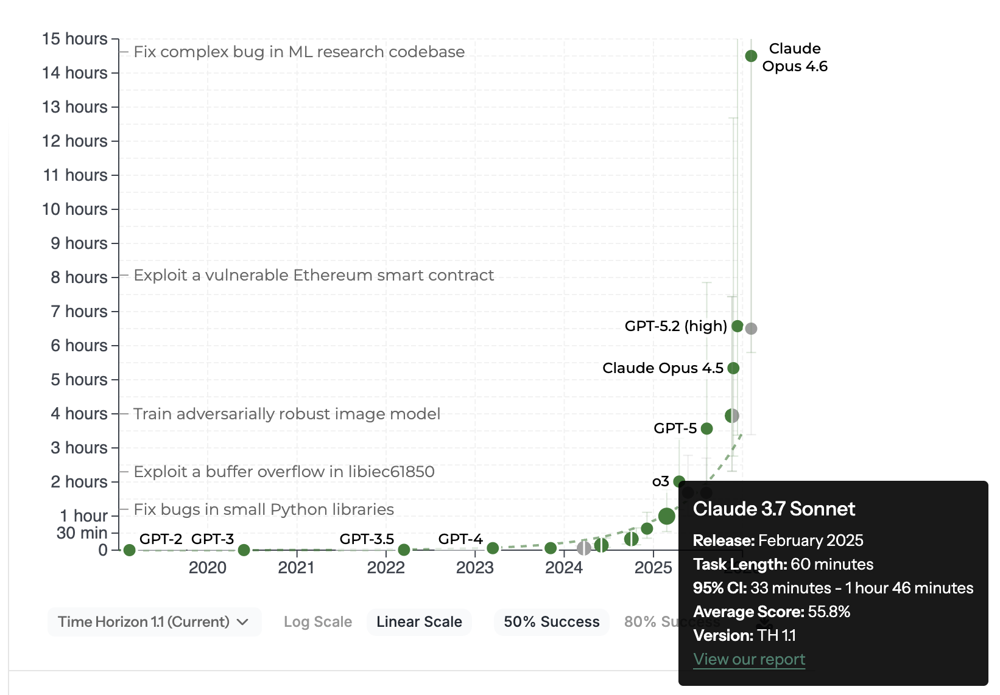

<!-- _class: lead invert -->
<!-- _paginate: false -->

# AI로 나의 능력을 증폭시키는 법

## 비개발자를 위한 바이브 코딩 워크숍

<br>

다이렉트 클라우드랩

---

# 바이브 코딩이란?

> "fully give in to the vibes, embrace exponentials,
> and forget that the code even exists."
> — Andrej Karpathy, 2025. 2.

- OpenAI 공동창업자 Andrej Karpathy가 정의한 AI 기반 개발 방식
- 2025년 **Collins 영어사전** 올해의 단어 선정
- 자연어로 AI에게 지시하여 결과물을 만드는 접근법

<br>

**코딩 실력이 아니라, 문제를 정의하는 능력이 핵심이다.**
AI에게 무엇을, 어떻게 요청하느냐가 결과의 품질을 결정한다.

---

# 비개발자에게 바이브 코딩이란?

- 코드를 작성하는 것이 아니라, **자연어로 AI에게 지시**하여 결과물을 만드는 것
- 프로그래밍 지식 없이도 **문서, 데이터 분석, 도구, 앱**을 만들 수 있다
- AI는 나의 능력을 **증폭시켜주는 도구** — 대체가 아닌 협업

| 기존 방식 | 바이브 코딩 방식 |
|---|---|
| 개발자에게 요청 → 대기 → 결과 확인 | AI에게 직접 지시 → 즉시 결과 확인 |
| 엑셀 함수를 배워서 직접 작성 | AI에게 원하는 결과를 설명 |
| 디자이너에게 목업 의뢰 | AI에게 화면 설계를 요청 |
| 기획서를 처음부터 작성 | AI와 인터뷰하며 함께 작성 |

---

<!-- _class: lead invert -->

# 왜 지금 시작해야 하는가?

---

# AI 능력의 기하급수적 성장 — METR 시간 지평선



- **시간 지평선:** AI가 50% 확률로 완료하는 작업 난이도를 인간 전문가 소요 시간으로 표현
- GPT-2(2019) → Opus 4.6(2026): **0분 → 14시간 30분**
- **약 7개월마다 두 배씩** 증가

> 지금 14시간짜리 작업을 해결하는 AI가,
> 7개월 뒤에는 28시간짜리 작업을 해결한다.

<span class="source">출처: METR, news.hada.io/topic?id=26872</span>

---

# 경쟁자를 압도하는 생산성 — Anthropic 내부 사례

| 지표 | 수치 |
|------|------|
| 자체 보고 생산성 향상 | **50%** (전년 20% → 50%) |
| 일상 업무 AI 활용률 | **59%** (전년 28% → 59%) |
| 엔지니어당 일일 성과물 | **67%** 증가 |

> "산출물의 볼륨 자체가 크게 증가했다." — Anthropic Engineering

<span class="source">출처: Anthropic Economic Index (2025.9)</span>

---

# 비개발자도 증명된 효과 — Anthropic 실제 활용 사례

### 프로덕트 디자인팀 (비개발 직군)
목업 이미지를 AI에 전달 → 기능 프로토타입 생성, **2~3배 빠른 실행**
1주일간의 코디네이션 작업 → **30분 x 2회 콜로 완료**

### 데이터 인프라팀
Kubernetes 장애를 **비전문가**가 AI 도움으로 **독립 해결**
대시보드 스크린샷을 AI에 제공 → 원인 진단 → 조치 방법 생성

### 핵심 메시지
AI는 **전문 지식의 진입 장벽**을 낮춘다.
비개발자도 AI와 함께라면 개발자의 영역에 접근할 수 있다.

<span class="source">출처: codingscape.com/blog/how-anthropic-engineering-teams-use-claude-code-every-day</span>

---

# 바이브 코딩의 생산성 방정식

## 커뮤니케이션 비용 산출 방정식

$$C = \frac{n(n-1)}{2} \quad $$

- $C$: 커뮤니케이션 비용, $n$: 프로젝트에 참여하는 사람 수
- 사람이 많을수록 소통 비용이 **기하급수적**으로 증가

## 바이브 코딩 생산성 방정식

$$P = A \times D + R $$

- $P$: 총 생산성, $A$: AI 도구의 증폭 배수, $D$: 나의 업무 역량, $R$: AI 단독 생산성
- **핵심: AI는 나의 역량($D$)을 증폭($A$)시킨다** — 내가 잘 아는 분야일수록 효과가 크다

---

<!-- _class: lead invert -->

# 케이스 스터디: Austin Lau

## 코드 한 줄 모르던 마케터가 만든 자동화 시스템

---

# Austin Lau — Anthropic 유일한 그로스 마케터

| 항목 | 내용 |
|------|------|
| 역할 | Anthropic **1인 그로스 마케팅 팀** (10개월간) |
| 담당 업무 | Paid Search, Paid Social, ASO, 이메일, SEO |
| 코딩 경험 | **전무** — 터미널 여는 법부터 구글 검색 |
| 이전 경력 | Dropbox, Webflow, Notion 그로스 마케팅 |
| 도구 | Claude Code |

**터미널 여는 법도 몰랐던 사람이, 1주일 만에 자동화 시스템을 구축했다.**

> "내가 '이런 게 있었으면' 하고 바라던 것과
> '직접 만들 수 있다'의 거리는 생각보다 훨씬 가깝다." — Austin Lau

<span class="source">출처: Anthropic "How the Anthropic Team Uses Claude Code" (2026.1)</span>

---

# Austin이 1주일 만에 구축한 시스템

| # | 자동화 시스템 | 효과 |
|---|-------------|------|
| ① | 기존 광고 데이터 CSV 분석 → **성과 낮은 광고 자동 식별** | 데이터 기반 의사결정 |
| ② | 2개의 AI 에이전트로 **광고 카피 자동 생성** | 수백 개 변형 즉시 생성 |
| ③ | Figma 플러그인으로 **광고 디자인 자동 생성** | 30분 → **30초**, 최대 100개 변형 |
| ④ | Meta Ads API + MCP 서버 | AI 안에서 광고 성과 **즉시 분석** |
| ⑤ | Memory 시스템 — 실험 결과 자동 기록 | 반복할수록 **시스템이 똑똑해짐** |

### 최종 결과
광고 제작: **2시간 → 15분** / 전환율 업계 평균 대비 **41% 향상**
**1명이 대형 마케팅 팀처럼 일하게 되었다.**

<span class="source">출처: letter.wepick.kr/post/24049, lcreator.beehiiv.com</span>

---

# 핵심: 작업을 전문화된 에이전트로 분해

### 광고 카피 생성 — 하나의 프롬프트로 다 하지 않았다

| 에이전트 | 역할 | 제한 |
|---------|------|------|
| **Headline Agent** | 광고 제목 생성 전담 | 30자 제한 준수 |
| **Description Agent** | 광고 설명문 생성 전담 | 90자 제한 준수 |

→ 역할을 나누니 **각 에이전트가 전문가처럼** 동작
→ 출력은 CSV로 내보내 **Google Ads에 바로 업로드**

### Memory 시스템 — 반복할수록 똑똑해지는 구조

- 매 실험 결과를 **자동 기록**
- 다음 라운드에 **과거 데이터 자동 반영**
- 사람이 기억할 필요 없이 **시스템이 학습**

---

# Austin 사례가 보여주는 구조

### 대부분의 사람 vs Austin의 접근법

| 일반적인 AI 활용 | Austin의 AI 활용 |
|---|---|
| "광고 만들어줘" | 반복 업무를 **먼저 식별** |
| 하나의 프롬프트로 모든 것을 요청 | 각 작업을 **전문화된 에이전트로 분해** |
| 매번 처음부터 다시 시작 | 실험 결과를 **시스템이 기억** |
| AI를 카피 도우미로 사용 | **업무 시스템 자체**를 AI로 구축 |

<br>

> **"AI를 쓴다"와 "AI로 일하는 방식을 바꾼다"는 다르다.**
> Austin은 코드를 몰랐지만, 자기 업무의 전문가였다.
> 그 전문성 + AI = 대형 팀의 산출물.

---

<!-- _class: lead invert -->

# 여러분의 현재 상황

---

# 설문으로 본 우리의 모습

| 항목 | 수치 | 의미 |
|------|------|------|
| AI 매일 사용 | **75%** | 이미 AI를 쓰고 있다 |
| 결과 품질 불안정 | **83%** | 하지만 **잘** 쓰고 있지는 않다 |
| 결국 내가 다 고침 | **58%** | AI → 사람 수정의 비효율 루프 |
| 반복 업무 자동화 희망 | **58%** | 가장 원하는 것은 시간 절약 |
| 작업시간 50% 단축 기대 | **42%** | 체감할 수 있는 성과를 원한다 |

<br>

> **이 워크숍은 AI 입문이 아닙니다.**
> AI를 **믿을 수 있게** 만드는 법을 배우는 시간입니다.

---

# 왜 AI 결과물이 들쑥날쑥할까?

### 원인: "모호한 요청 → 모호한 결과"

| 비효율적 요청 | 효과적 요청 |
|---|---|
| "보고서 써줘" | "B2B SaaS 월간 매출 보고서를 작성해줘. 대상은 경영진이고, 핵심 KPI 3개와 전월 대비 변동을 포함해줘" |
| "이거 정리해줘" | "이 CSV 데이터를 부서별로 그룹화하고, 각 부서의 총액과 비율을 표로 만들어줘" |
| "좋은 아이디어 없어?" | "우리 CS팀은 월 500건 문의를 처리합니다. 문의 유형 분류를 자동화할 방법을 3가지 제안해줘" |

**AI는 마법이 아니라 도구다.**
도구를 잘 쓰려면 **무엇을 원하는지 명확히** 전달해야 한다.

---

<!-- _class: lead invert -->

# AI가 주는 진정한 가치

---

# AI ≠ 일을 대신 해주는 도구

AI는 단순히 일을 대신 해주는 도구가 아니다

**나의 능력을 증폭시켜주는 도구** 이다

| 피상적 가치 | 진정한 가치 |
|-------------|-------------|
| 문서 초안 자동 생성 | **기획자**로서 더 많은 아이디어를 실험 |
| 데이터 정리 자동화 | **분석가**로서 인사이트 발견에 집중 |
| 반복 작업 제거 | **전문가**로서 고부가가치 업무에 집중 |
| 코드 없이 도구 제작 | **혁신가**로서 아이디어를 직접 구현 |

---

# AI와 학습의 혁명

**전통적 학습 (바텀업)**
교재를 처음부터 끝까지 → 느리고, 동기부여 어려움

**AI와 함께하는 학습 (톱다운 드릴링)**
무언가를 하는 가운데 → 필요한 시점에 → 필요한 부분만 깊이 파고들기

| AI 학습의 장점 | 설명 |
|---------------|------|
| 맥락 이해 | 왜 배우려 하는지 대화 히스토리로 파악 |
| 수준 맞춤 | 나의 이해 수준에 맞춘 설명 |
| 확인 학습 | 제대로 이해했는지 검증하며 진행 |
| 실용적 | 실제 작업 중 필요한 것만 학습 |

> 모르는 것이 있어도 괜찮다 — AI에게 물어보면 된다.

---

<!-- _class: lead invert -->

# AI와 효과적으로 대화하는 법

---

# 핵심 패턴 1: 역할 + 맥락 + 출력형식

```text
당신은 [역할]입니다.
[배경 상황 설명]
[원하는 결과물의 형식]으로 작성해주세요.
```

### 예시

| 나쁜 프롬프트 | 좋은 프롬프트 |
|---|---|
| "제안서 써줘" | "당신은 10년 경력의 B2B 영업 컨설턴트입니다. 우리 회사의 클라우드 모니터링 솔루션을 금융권 CTO에게 제안하는 제안서를 작성해주세요. A4 3장 분량으로, 도입 효과를 수치로 포함해주세요." |

**역할**을 지정하면 AI가 해당 분야의 전문성을 발휘한다.
**맥락**이 충분할수록 결과의 정확도가 올라간다.

---

# 핵심 패턴 2: 심층 인터뷰 — AI에게 질문을 시키기

```text
[주제]에 대해 심층 인터뷰를 진행해주세요.
한 번에 한 가지 질문만 하고, 제 답변을 바탕으로 다음 질문을 만들어주세요.
```

### 왜 강력한가?

| 내가 직접 쓸 때 | AI가 인터뷰할 때 |
|---|---|
| 내가 아는 것만 쓴다 | AI가 **내가 모르는 것**을 질문한다 |
| 구조를 잡기 어렵다 | AI가 체계적으로 정리해준다 |
| 빠뜨리는 항목이 많다 | AI가 누락을 방지한다 |

> 프롬프트를 잘 쓰는 것보다,
> **AI에게 질문을 시키는 것**이 더 효과적이다.

---

# 핵심 패턴 3: 검수 루프 — AI 결과물의 품질 높이기

### 83%가 겪는 "결과 품질 불안정" 문제의 해법

```text
[결과물]을 만들어주세요.
완성 후 스스로 검토해서 부족한 점을 수정해주세요.
```

### 3단계 검수 루프

| 단계 | 내용 | 프롬프트 예시 |
|------|------|-------------|
| 1. 생성 | AI가 초안 작성 | "월간 보고서 초안을 작성해줘" |
| 2. 자가 검토 | AI가 스스로 검토 | "이 보고서를 비판적으로 검토해줘" |
| 3. 수정 | 피드백 반영 | "검토 결과를 반영해서 수정해줘" |

**한 번에 완벽한 결과를 기대하지 마라.**
**반복 개선이 핵심이다.**

---

# 핵심 패턴 4: 단계적 접근 — 큰 작업을 작게 나누기

### 한 번에 모든 것을 시키지 마라

| 비효율적 | 효율적 |
|---|---|
| "CS 자동화 시스템 만들어줘" | 1단계: "CS 문의 유형을 분석해줘" |
| | 2단계: "문의 분류 기준을 만들어줘" |
| | 3단계: "분류 기준으로 자동 응답 템플릿을 만들어줘" |
| | 4단계: "전체를 하나의 워크플로우로 연결해줘" |

**작은 단계로 나누면:**
- 각 단계의 결과를 **확인하고 수정**할 수 있다
- AI가 **맥락을 유지**하며 일관된 결과를 만든다
- 문제가 생겨도 **되돌리기가 쉽다**

---

<!-- _class: lead invert -->

# 워크숍 도구 소개

---

# 클로드 앱 — 4가지 모드로 모든 것을 해결

| 모드 | 용도 | 비유 |
|------|------|------|
| **채팅** | 대화, 브레인스토밍, 질문 | 똑똑한 동료와 대화 |
| **코드** | 파일 생성·수정, 프로젝트 관리 | AI 비서가 내 컴퓨터에서 작업 |
| **코워크** | 컴퓨터 작업을 AI가 대신 수행 | AI가 내 화면을 보며 대신 클릭 |
| **아티팩트** | 독립 콘텐츠 생성 (문서, 코드, 다이어그램) | AI가 만든 완성품 미리보기 |

<br>

### 오늘 워크숍의 도구 사용 흐름

**채팅**(아이디어) → **코드**(PRD 작성) → **아티팩트**(목업) → **코드**(구현 + 계획)

---

# 채팅 모드 — 브레인스토밍의 파트너

**무엇을 만들지 모를 때, 채팅으로 시작한다**

### 활용법

- 내 업무의 문제점을 이야기하면 AI가 **해결 방안을 제안**
- "이건 가능해?"라고 물으면 AI가 **기술적 실현 가능성을 판단**
- 여러 방안의 **장단점 비교**를 요청

### 핵심 팁

> 처음부터 완벽한 아이디어가 필요 없다.
> **"이런 게 불편한데..."** 로 시작해도 충분하다.

---

# 코드 모드 — AI 비서가 내 컴퓨터에서 작업

**파일을 만들고, 수정하고, 프로젝트를 관리한다**

### 활용법

- 아이디어 문서로부터 **PRD(제품 요구사항 문서)** 생성
- AI의 **심층 인터뷰**를 통해 요구사항 구체화
- 완성된 PRD로 **동작하는 목업** 제작
- 개발 계획 문서 작성 + **GitHub 이슈 등록**

### 핵심 팁

> 코드 모드에서는 AI가 **파일을 직접 생성하고 수정**한다.
> 여러분은 결과를 **확인하고 피드백**만 주면 된다.

---

# 코워크 모드 — AI가 대신 설치하고 설정

**환경 설정, 도구 설치를 AI가 대행한다**

### 오늘 코워크가 해줄 것

- 코드 CLI, Git, GitHub CLI, VSCode 설치
- YOLO 모드 설정 (권한 확인 없이 자동 실행)
- 실습용 프로젝트 폴더 생성 + GitHub 연결

### 핵심 팁

> "저는 비개발자입니다"를 반드시 알려주세요.
> AI가 **가장 쉬운 방법**으로 안내해줍니다.

---

<!-- _class: lead invert -->

# 오늘의 워크숍 여정

---

# 4단계로 아이디어를 현실로 만들기

| # | 단계 | 도구 | 산출물 |
|---|------|------|--------|
| 0 | 환경설정 | 코워크 | 실습 환경 + GitHub 리포지토리 |
| 1 | 문제 정의 | 채팅 | 아이디어 마크다운 문서 |
| 2 | PRD 작성 | 코드 (심층 인터뷰) | 제품 요구사항 문서 |
| 3 | 목업 제작 | 아티팩트 + 코드 | 동작하는 HTML 목업 |
| 4 | 개발 계획 | 코드 | GitHub 이슈 기반 개발 계획 |

<br>

> **코딩 없이, 자연어만으로** 전 과정을 진행합니다.
> 완주보다 **깊이** — 현재 단계에 집중하세요.

---

# 여러분이 오늘 경험할 것

### 1단계: 문제를 발견하고 정의하기
- 내 업무에서 가장 시간을 잡아먹는 문제를 AI와 함께 구체화

### 2단계: AI와 인터뷰하며 요구사항 완성하기
- AI가 질문하고, 내가 답하며, 빠뜨린 것까지 챙기기

### 3단계: 말로 설명한 것을 눈에 보이는 결과물로
- 동작하는 목업을 만들어 "이런 걸 원했어!" 확인

### 4단계: 개발자에게 넘길 수 있는 계획서 만들기
- GitHub 이슈로 체계적인 개발 요청

---

<!-- _class: lead -->

# 정리: 바이브 코딩으로 나의 능력을 증폭시키기

**AI는 나를 대체하는 것이 아니라, 나의 능력을 증폭시킨다**

1. **문제를 명확히 정의**하면 AI가 해결책을 만든다
2. **심층 인터뷰**로 프롬프트 작성의 부담을 AI에게 넘겨라
3. **검수 루프**로 AI 결과물의 품질을 안정시켜라
4. **지금이 가장 능력이 낮은 시점** — AI는 계속 발전한다

> 코딩을 몰라도 됩니다.
> 여러분의 업무 전문성 + AI = **전에 없던 생산성**

---

<!-- _class: lead invert -->

# 실습을 시작하겠습니다
